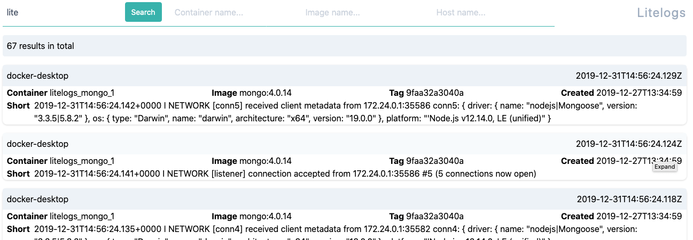

# Litelogs

Litelogs is a _very_ simple log aggregator geared towards docker containers.  It listens for incoming messages in GELF format and stores
them in MongoDB.  There is a web front-end which lets you search the logs via simple strings or regex.

__NOTE:__ This is a very early work-in-progress and should _not_ be used in production.



## Features

* It's very lightweight - around 25mb for the main process
* Can be scaled up very easily
* Customise log-retention duration
* Can forward incoming logs onto another server if needed for archive or further processing

## Project setup
```
npm install
node src/index.js
```

## Docker demo

If you have docker-compose available you _should_ be able to run

```
docker-compose up --build
```
After a little while you should have the front-end available at http://localhost:3002/ and a copy of mongo-express running at http://localhost:8081/ if you want to dig into the actual database.

## Configuration options

```
--debug                      output extra debugging
--api-debug                  log api requests
--no-alive                   don't output alive messages
--mongo <connection-string>  connection string for mongodb (default:
                            "mongodb://localhost:27017/litelogs")
--port <port-number>         port number to listen on (default: 12201)
--ip <ip-address>            IP address to bind to (default: "0.0.0.0")
--ttl <hours>                number of hours to retain logs (default: 0.1)
--user <username>            username for mongodb (default: "")
--password <password>        password for mongodb (default: "")
--forward <gelf-server>      forward messages to this server (default: "")
--api-port <port-number>     port for the api server (default: 3001)
--api-key <string>           The api key to use (default: "")
-h, --help                   output usage information
```
Most options are also available to be set via environment variables :
```
--mongo == LITELOG_MONGO
--port == LITELOG_PORT
--ip == LITELOG_IP
--ttl == LITELOG_TTL
--user == LITELOG_USER
--password == LITELOG_PASSWORD
--forward == LITELOG_FORWARD
--api == LITELOG_API_PORT
--api-key == LITELOG_API_KEY
```
